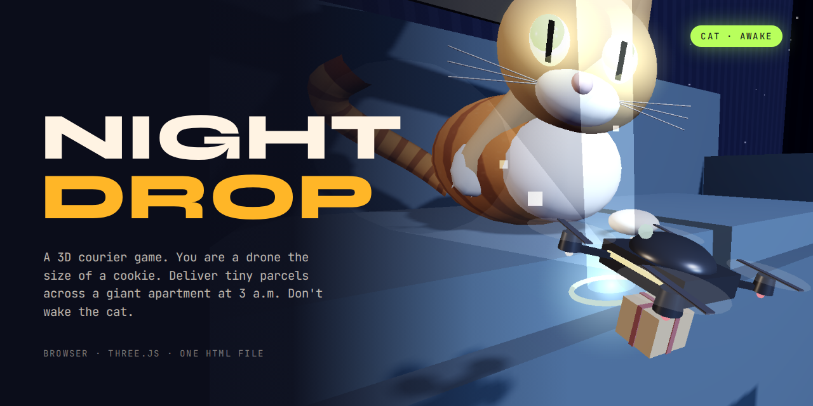
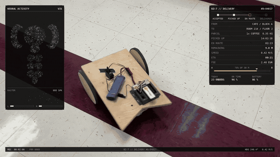
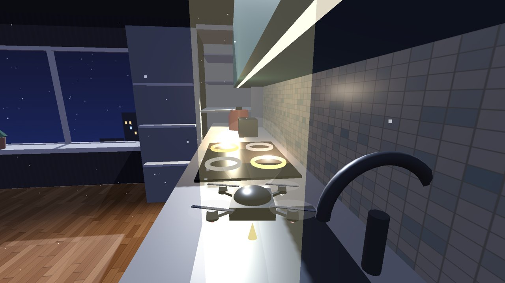
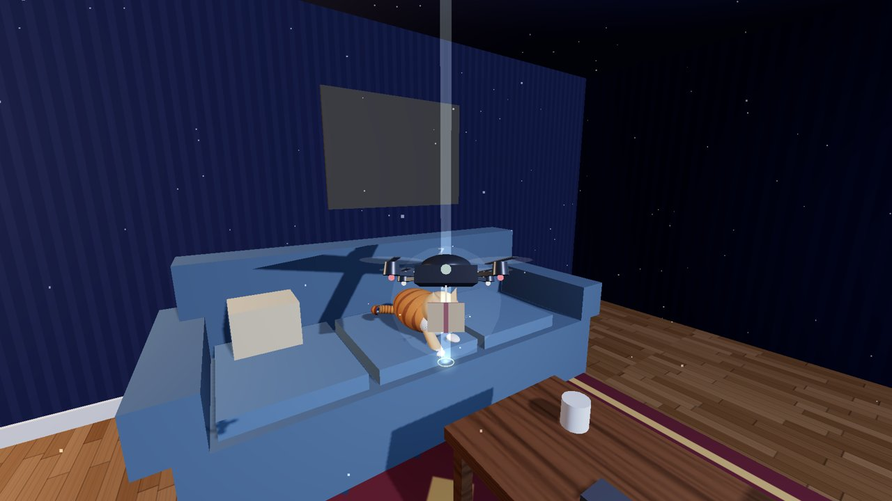
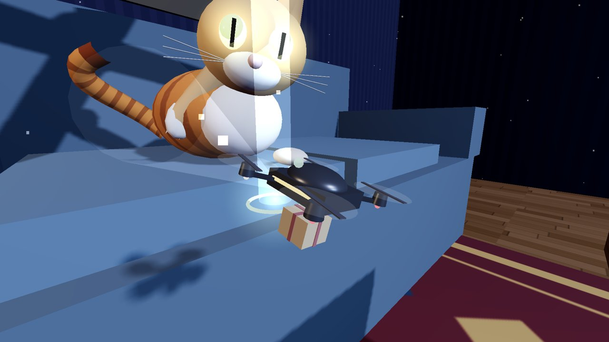

# buzzdrop v0.2 · Night Drop




**A 3D courier game in one HTML file.**

You are a drone the size of a cookie. It is 3 a.m. in a giant apartment. Pick up tiny parcels, drop them off before the timer runs out, and do not wake the cat.

**Play:** [gipppp121.github.io/buzzdrop](https://gipppp121.github.io/buzzdrop/) or just open `index.html` in a browser.

**Created by:** [@gippp69](https://x.com/gippp69)

**Workflow:** ideas and prompts from Grok 4.7, code built with Claude

---

## Demo



Autopilot run: pick up an AA battery by the cereal box, fly across the room, deliver it right under the cat's nose. The cat wakes up, tracks the drone and swipes.

| Kitchen | Living room | The cat |
|---|---|---|
|  |  |  |

---

## How to play

```text
W A S D          fly and strafe
Space / Shift    climb / dive
Mouse            look (click the room to lock the pointer)
Arrow keys       turn without a mouse
Touch            left half moves, right half looks, ▲ ▼ buttons for height
```

1. Fly to the **honey beam** and touch it. The parcel hangs under the drone.
2. Fly to the **mint beam**. The timer starts at pickup.
3. Faster delivery means a bigger tip. Late delivery pays half and resets your streak.

Your best shift is saved in the browser.

---

## The apartment

```text
THE KITCHEN     open fridge spilling light, stove, sink, kettle, cereal box
FRIDGE LIGHT    door shelves and the fridge top
DINING TABLE    plates, a water glass, a candle
WINDOWSILL      moonlight and the city outside
LIVING ROOM     sofa, coffee table, TV glow, floor lamp, ceiling fan
BOOKSHELF       narrow gaps between shelves
```

15 pickup and drop spots. Every order is a random item to a random spot in another zone: an AA battery, one sugar cube, a lost earring, a single Lego brick, a cat treat (hide it).

---

## Hazards

```text
CAT             sleeps on the sofa. Fast flight nearby fills the NOISE bar.
                Full bar or getting too close wakes it up.
                Awake: eyes glow, head tracks the drone, paw swipe.  -$20
HOT BURNERS     two burners are on. Hot air throws you upward.        -$10
CEILING FAN     downdraft under the blades, blade hit knocks you out. -$15
```

The cat falls back asleep if you stay away for a few seconds. In a long shift it moves between the sofa, the table and the counter.

---

## How it is built

```text
src/shell.html      HUD, intro card, styles
src/game.js         the whole game: room, cat, drone, physics, autopilot, HUD logic
tools/build.py      inlines fonts and game.js into index.html
tools/record.py     frame-by-frame recorder for gameplay videos
index.html          build output, the playable file
```

Everything in the room is built from boxes, spheres, cylinders and canvas textures at load time. No models, no image files, no game engine. The only dependency is three.js from cdnjs.

```text
room          boxes and cylinders, AABB collision list
lights        moon (shadows), fridge spot, candle, TV, lamp, under-cabinet strip
cat           procedural body, tube tail rebuilt every frame, eye glow sprites
drone         quad frame, spinning rotors, headlight cone, hanging parcel
physics       velocity with drag, AABB push-out, room bounds
autopilot     climb, cruise, low horizontal approach, land on target
```

---

## Build

```bash
python tools/build.py            # write index.html from src/
python tools/build.py --check    # CI: fail if index.html is stale
```

Edit `src/`, run the build, commit both.

---

## Recording a video

The game has a capture mode. With `?capture=1` nothing runs on its own clock. Each call to `window.__cap.step(n)` advances the world by `n` frames of 1/30 s and renders the last one, so a recording looks the same on a fast or slow machine.

```bash
pip install playwright
playwright install chromium
python tools/record.py --seconds 27 -o gameplay.mp4 --workers 2
```

```text
--pr 0.75       3D render scale, HUD stays sharp
--workers N     split the frames across N browser processes
--clean         hide the HUD
```

Needs ffmpeg on PATH. The demo above was recorded this way, software-rendered, about 2 s per frame per worker.

---

## Versions

- **v0.2** Night Drop, the game (this README)
- **v0.1** robot footage to fly-courier HUD, a Python CLI. Still in the git history.

---

## Roadmap

- [ ] sound: rotor hum that rises with speed, cat purr and hiss
- [ ] a second room: bathroom with a running tap
- [ ] daily route with a fixed seed so everyone plays the same shift
- [ ] gamepad support

---

## License

MIT. Fonts: Syne and JetBrains Mono, SIL Open Font License 1.1.
